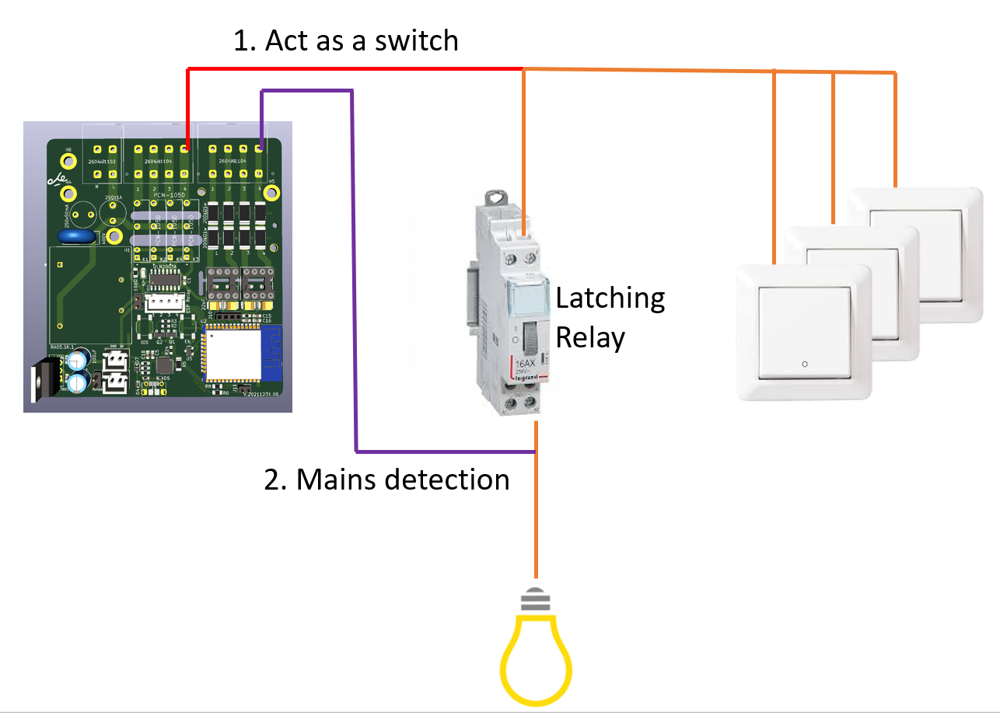
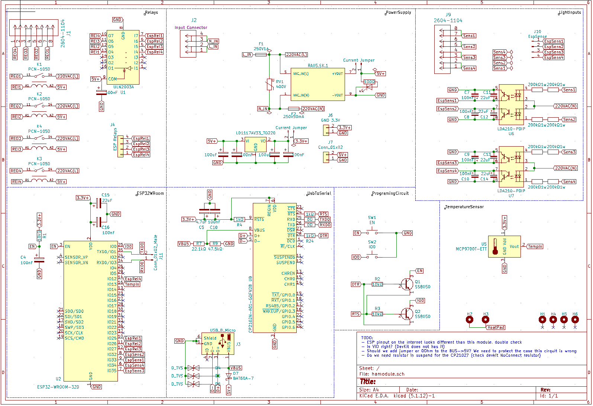
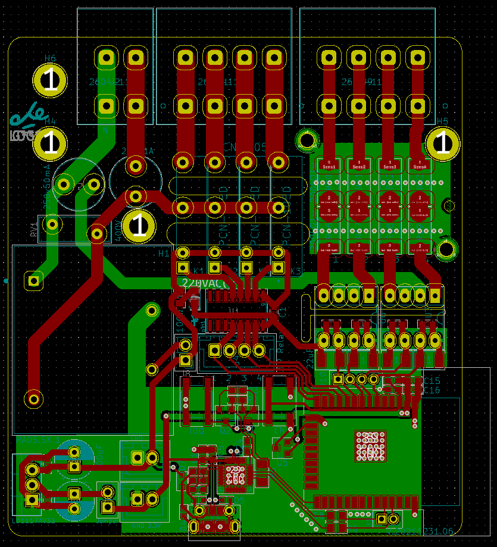
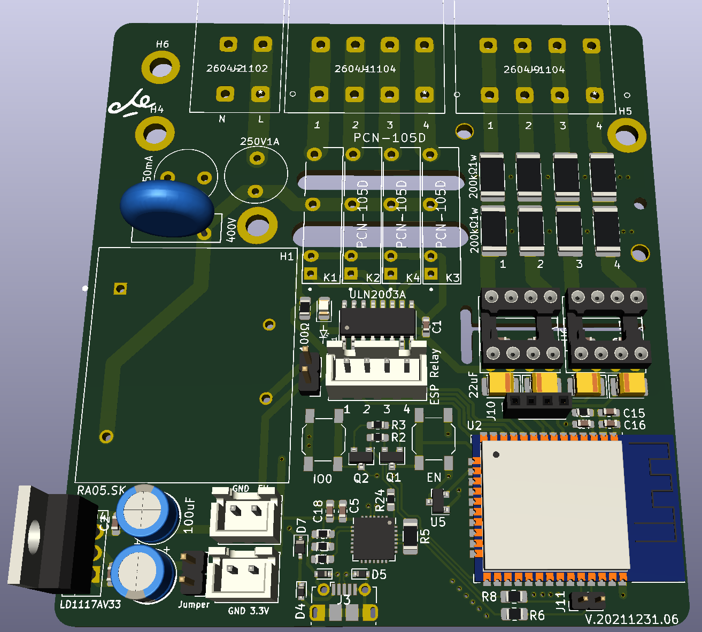

 # Home automation led controller custom module

 This circuit controll home lights following these rules:
 1. Safe: Safety is not trade in any decision.
 1. Fail safe: If this device fails, the ligts are still controllable using the mechanical switches.
 1. Follows standard instalation: This device does not require you to wire your house for it.
 1. It can be installed centrally

 Following those rules and using as a reference a multi-switch light controlled with a mechanical latching relay, this is the wiring idea:

A normal circuit sends all push buttons to the latching relay, which controlls the lights.
This circuit (ESPHome) is a side-car to the latching relay acting as an standard push button, but also sensing the output of the latching relay to detect if the lights are on or off.

# Changes in this version

This version was minimized by:
* Using SPST-NO 3A smaller relays
* Using SMD 3W 200k resistors instead of THT
* Removed external buttons connector
* Removed external leds connector
* Using SMD ULN2003A instead of THT
* Optocoupler THT capacitors replaced by Tantalum SMD
* Using bidirectional optocoupler (LDA210) instead of HCPL3700 to reduce Power dissipation (less current needed)
* Embedding an ESP32 into the board, and adding USB-to-Serial circuitery with CP2102N

Security additions:
* Added fuse at the neutral return from the sensors (F2)
* Resistors are before optocoupler, to make them work with less than 2V to N, instead of 110V to N

Stability:
* Added filter capacitor to ULN2003A
* Added filter capacitors to LD1117AV33

Others:
* Added led indicator when powered-on

Device schematics (under development) 

