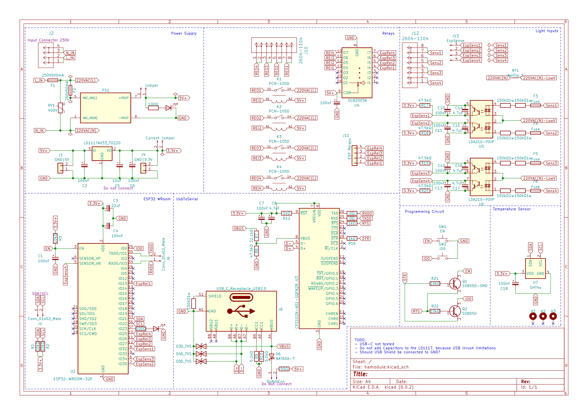
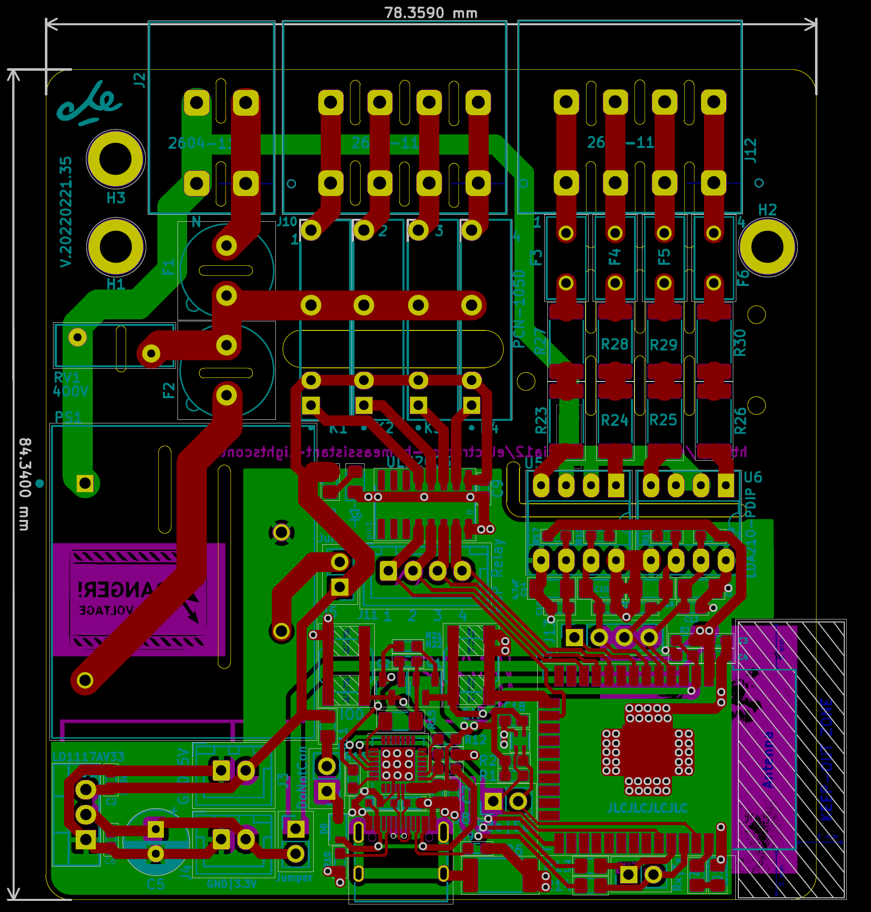
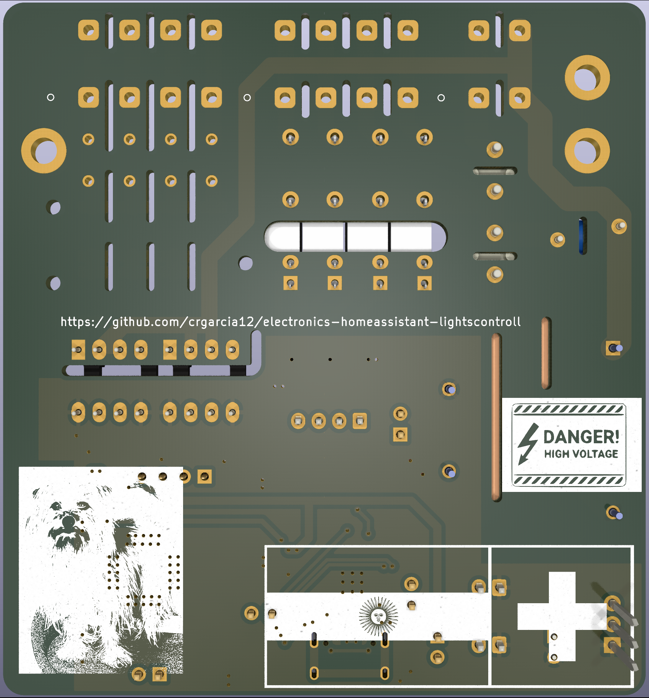
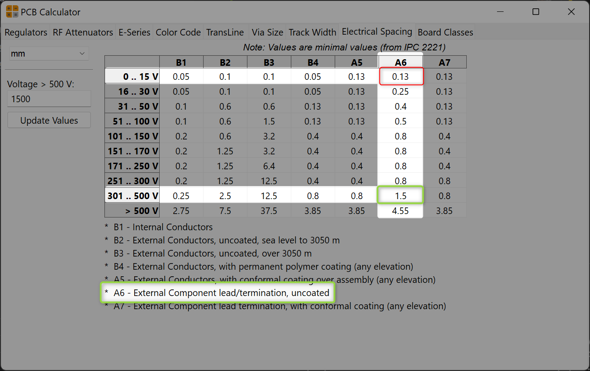
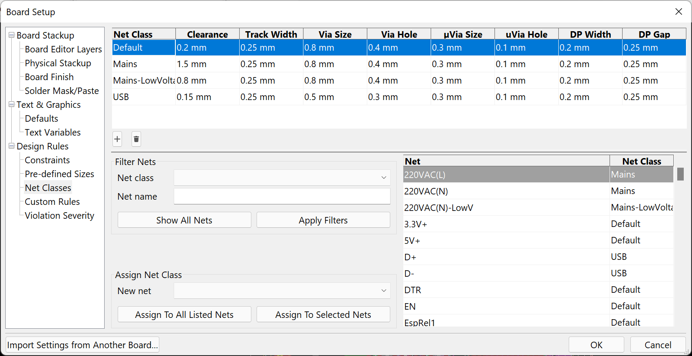

 # Home automation led controller custom module

 This circuit controll home lights following these rules:
 1. Safe: Safety is not trade in any decision.
 1. Fail safe: If this device fails, the ligts are still controllable using the mechanical switches.
 1. Follows standard instalation: This device does not require you to wire your house for it.
 1. It can be installed centrally

The circuit is placed close to the mains switching box, next to the latching relays. Wiring: 

A normal circuit sends all push buttons to the latching relay, which controlls the lights.
This circuit (ESPHome) is a side-car to the latching relay acting as an standard push button, but also sensing the output of the latching relay to detect if the lights are on or off.

# Changes in this version

This version was minimized by:
* Using SPST-NO 3A smaller relays
* Using SMD 1W 150k resistors instead of THT
* Removed external buttons connector
* Removed external leds connector
* Using SMD ULN2003A instead of THT
* Optocoupler THT capacitors replaced by Tantalum SMD
* Using bidirectional optocoupler (LDA210) instead of HCPL3700 to reduce Power dissipation (less current needed)
* Embedding an ESP32 into the board, and adding USB-to-Serial circuitery with CP2102N
* Adding USB-C support
* Adding I2C temperature IC. To alert in case the board get hot
* Adding debug*ging pins for I2C and Serial
* Adding led to ESP32 pin
* Fix bug: ESP32 cannot pull up on all pins - adding external pull-ups resistors

Security additions:
* Added fuses to every sensing channel
* Resistors are before optocoupler, to make them work with less than 2V to N, instead of 110V to N
* Production board is conformal coated with a silicone resin Electrolube SCC3

Stability:
* Added filter capacitor to ULN2003A
* Added filter capacitors to LD1117AV33

Others:
* Added led indicator when powered-on

Device schematics (under development) 

# Clearance
There are three nets: Default, Mains-LowVoltage and Mains. Even when conformal coating is added, Clearance are calculated without it for added safety. In practice, instead of using A7, A6 is being used to do the calculations:

* Default: Low voltage - 0.2mm
* Mains-LowVoltage: A6 < 2V = 0.13. For added safety 0.8 mm is used (red) 
* Mains: A6 for > 300V = 1.5mm (green)

# Development notes

## Generating fabrication files for JLCPCB
1. Plot PCB Gerber + Drill + Map:

    
    

1. Bom files
    
    

    Command: python3 "C:\Program Files\KiCad\bin\scripting\plugins/bom_csv_jlcpcb.py" "%I" "%O.csv"
    

1. Drill files
    
    
    run the python script to rotate the components
    

    PS C:\\...\smt-assembly> python3 .\kicad-to-jlcpcb-pos.py .\hamodule-top-pos.csv .\hamodule-top-pos-jlcpcb.csv

## Generate documents

schematics:

PCBNew:

Print to PDF, and then use an online tool to get high resolution images