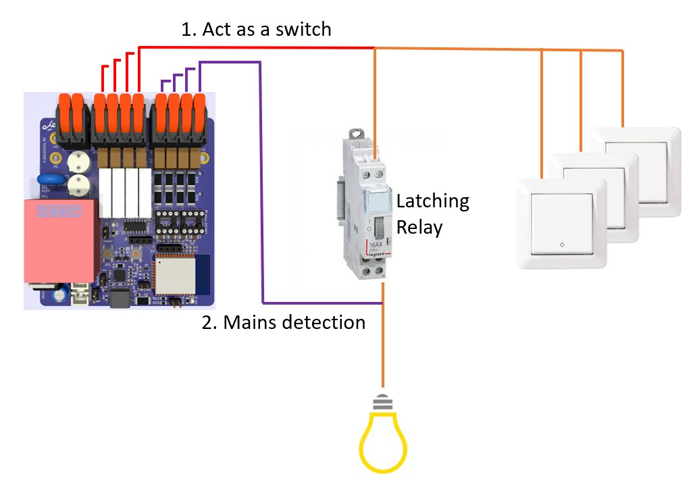
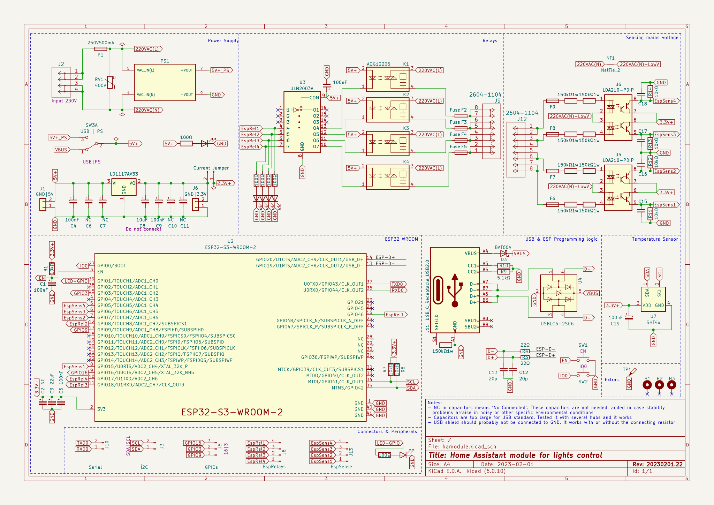
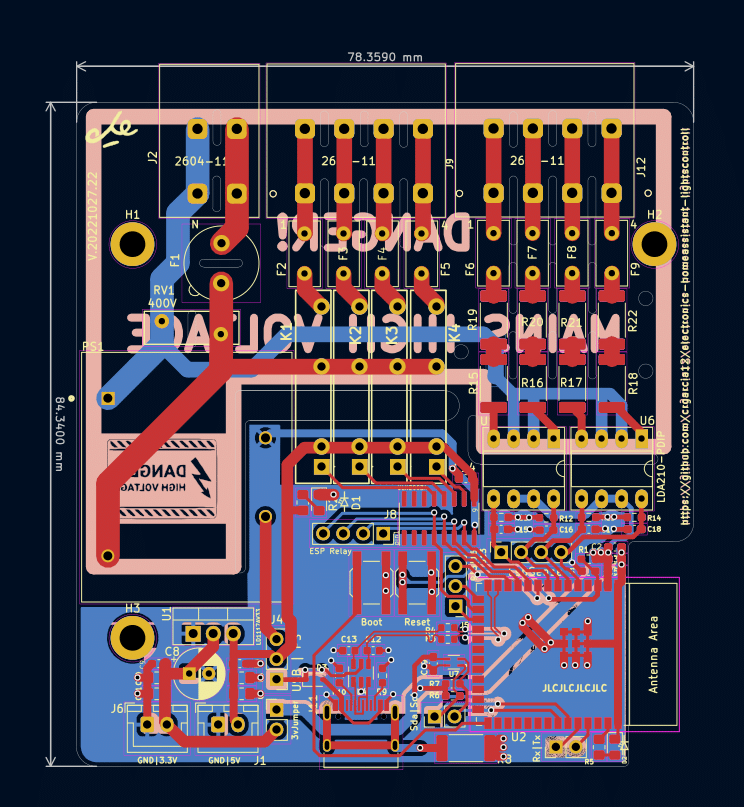
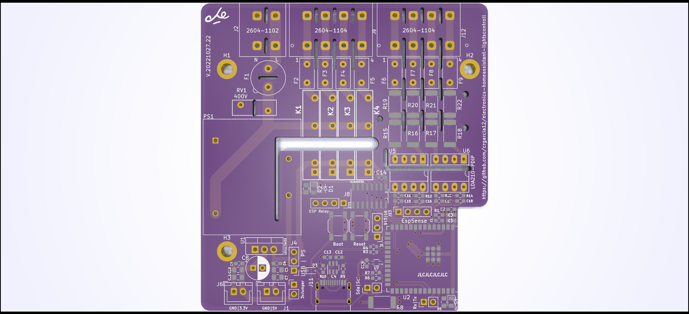
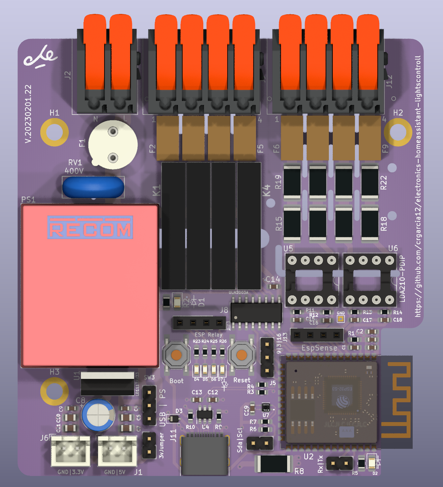
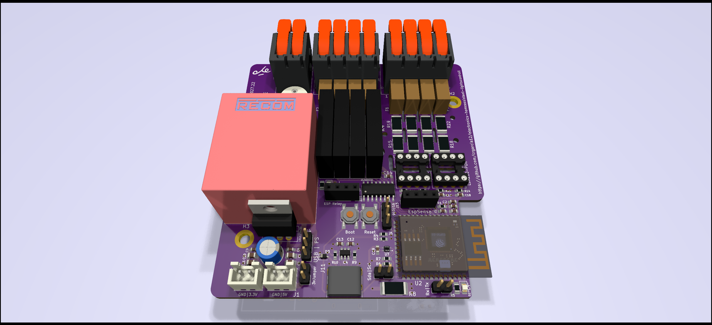
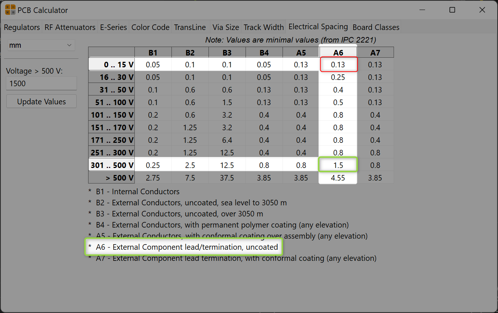
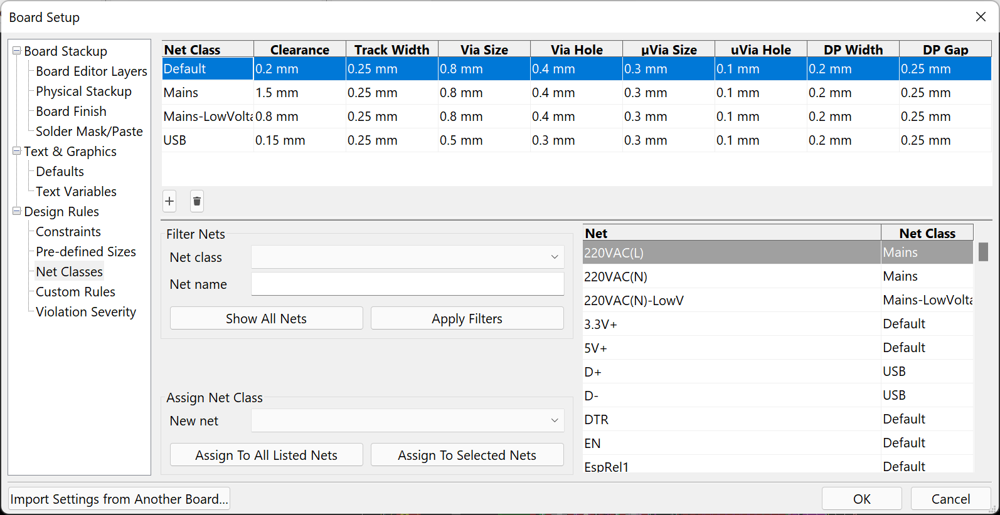

 # Home automation led controller custom module

 This circuit controll home lights following these rules:
 1. Safe: Safety is not trade in any decision.
 1. Fail safe: If this device fails, the ligts are still controllable using the mechanical switches.
 1. Follows standard instalation: This device does not require you to wire your house for it.
 1. It can be installed centrally

The circuit is placed close to the mains switching box, next to the latching relays. Wiring: 

A normal circuit sends all push buttons to the latching relay, which controlls the lights.
This circuit (ESPHome) is a side-car to the latching relay acting as an standard push button, but also sensing the output of the latching relay to detect if the lights are on or off.

# Changes in this version

* Using ESP32-S3-WROOM-2
* Using internal USB port
* Exposing a third GPIO (3,9,16)
* Changed USB protections by USBLC6-2SC6

# Device schematics

# PCB images

Solder mask color: #54006ED4

# Clearance
There are three nets: Default, Mains-LowVoltage and Mains. Even when conformal coating is added, Clearance are calculated without it for added safety. In practice, instead of using A7, A6 is being used to do the calculations:

* Default: Low voltage - 0.2mm
* Mains-LowVoltage: A6 < 2V = 0.13. For added safety 0.8 mm is used (red) 
* Mains: A6 for > 300V = 1.5mm (green)

