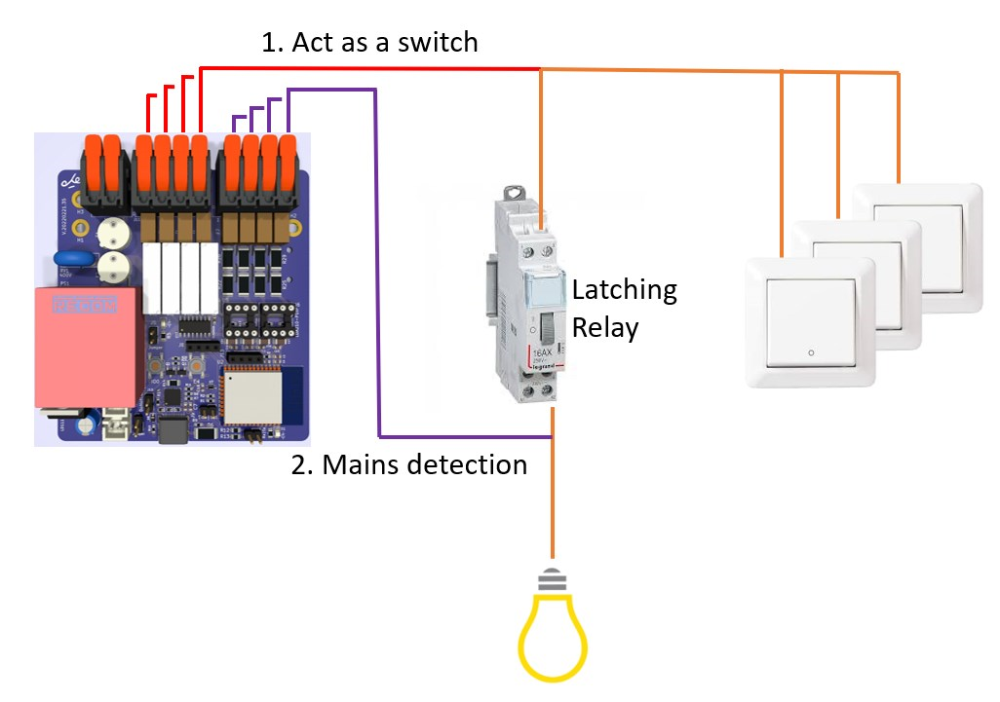
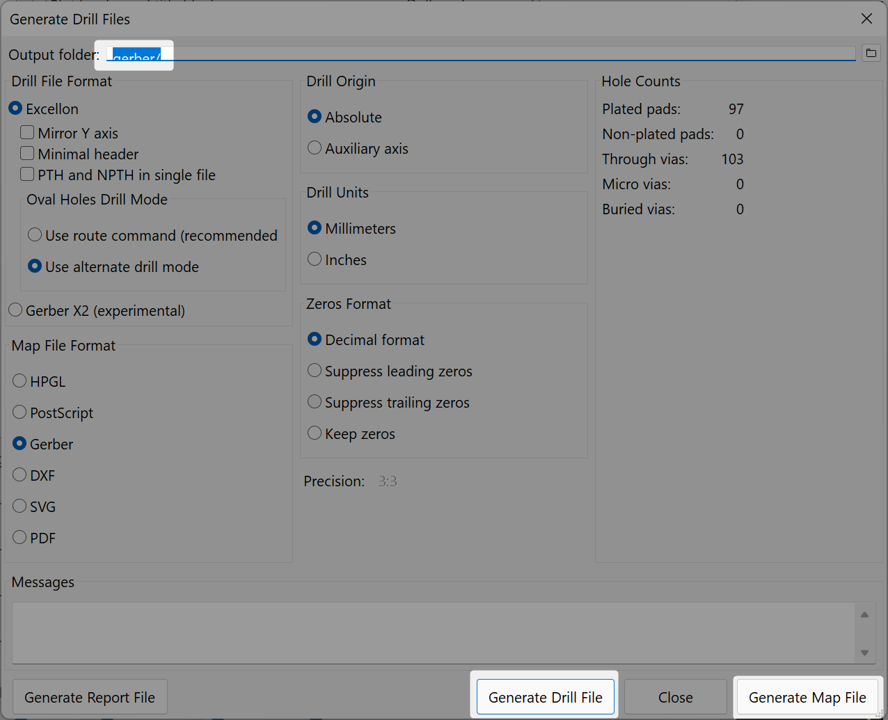
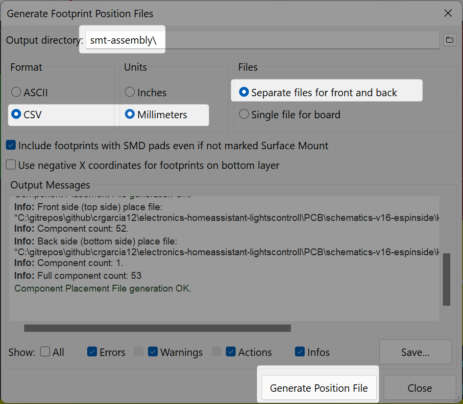
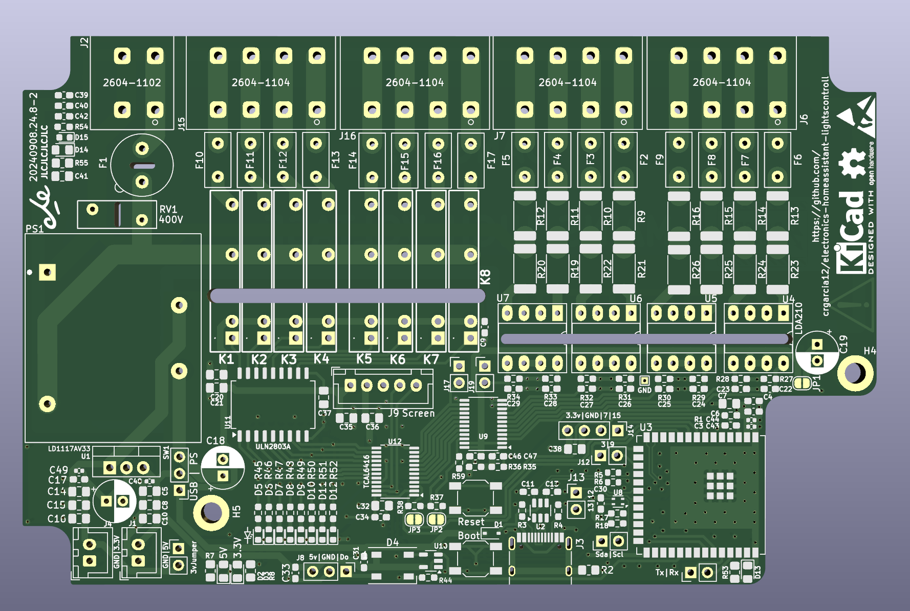
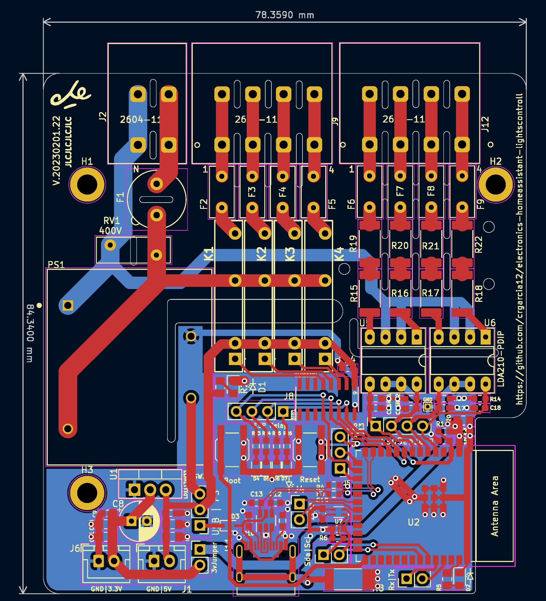
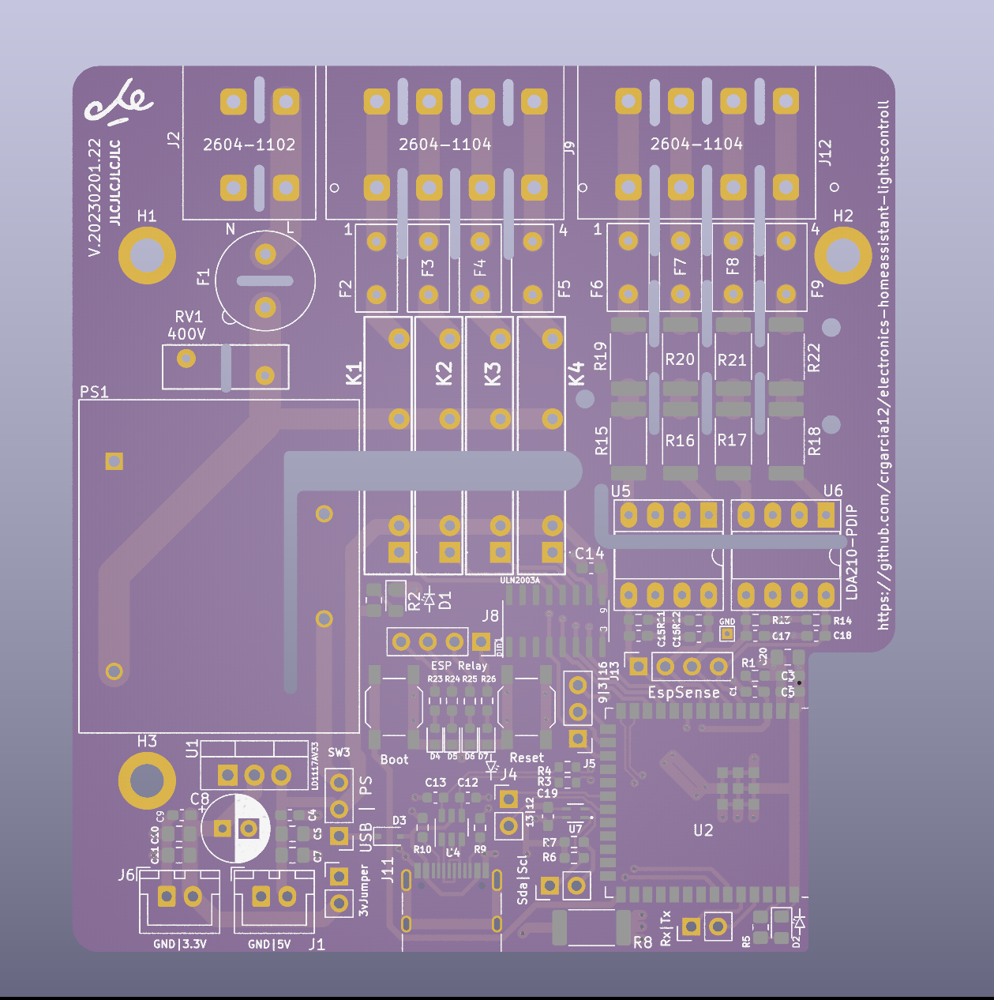
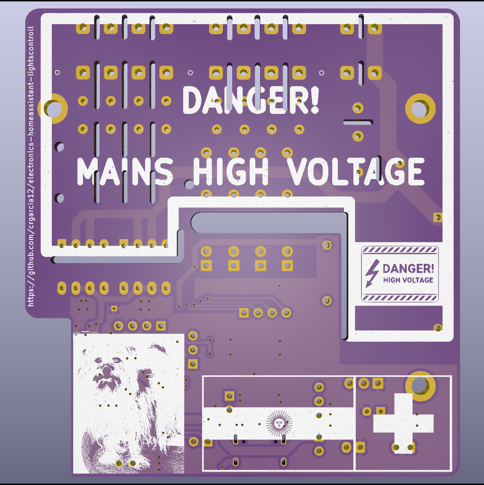
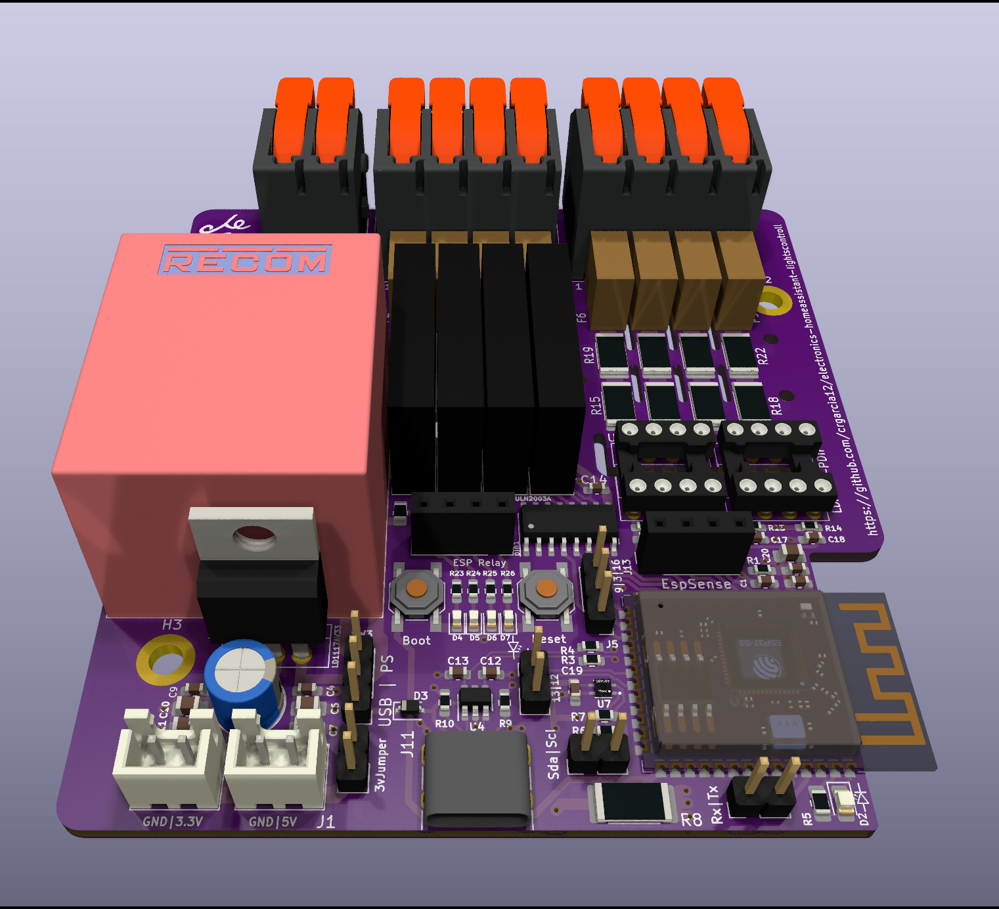

 # Home automation lights controller - ESPHome & Home Assistant compatible

 This circuit controls home lights following these rules:
 1. Safe: Safety is first and is not traded in any decision
 1. Fail safe: If this device fails, the ligts are still controllable using the mechanical switches
 1. Follows standard instalation: This device does not require you to wire your house for it
 1. It can be installed centrally

 Following those rules and using as a reference a multi-switch light controlled with a mechanical latching relay, this is the wiring idea:



A normal circuit sends all push buttons to the latching relay, which controlls the lights.
This circuit (ESPHome) is a side-car to the latching relay acting as an standard push button, but also sensing the output of the latching relay to detect if the lights are on or off.

This device is extensible:
- Expose I2C pins
- Expose Serial pins
- Expose many GPIOs
- 3.3V jumper: Allows to disconnect the internal ESP32, and replace it by any other microcontroller
- Relays pins (4 channel version): Relays can be controlled with an external microcontroller or device directly 
- Current sensing pins: Current sensing information is exposed through those pins. This can be used to connect any external microcontroller or any other device
- Provides 3.3V and 5V
- ESPHome compatible - It's very easy to integrate to Home Assistant

This device has several security measurements:
- Input fast-blown fuse
- Input MOV
- Slow fuses in every relay output
- Slow fuses in every mains detection input
- 4kv insulated PS for low voltage
- Comformal coating with 90kV/mm2 insulation
- High precision temperature sensor

There are two versions of the board, one with four channels and another with eight channels.
Latest versions use ESP32-S3, which is a very powerful microcontroller with a lot of features.

# Version 27
This is an evolution of 26.1. That is the right size that fit perfectly the case

Version 7 (SN74LVCH8 + OUTPUT_ENABLED)


# How does it work?
## Mains sensing
The PCB uses an optocoupler (LDA210 or ILD755) to detect the presence of mains voltage. These darlington optocouplers are chosen specifically for their low current requirements, drawing only 0.7mA at less than 2V. This low-power design allows for efficient sensing without overheating components.

To reduce the mains voltage to a safe level for the optocoupler, a 300kΩ resistance setup is used. This configuration dissipates only 0.17W, which is split across two resistors. Each resistor, therefore, dissipates about 0.08W, preventing overheating issues commonly seen with other designs (such as those using the HCP chip). This improvement enhances both the safety and longevity of the PCB.

Each mains sensing channel is equipped with a fuse to protect against failures. In the event that one of the resistors fails short, the remaining resistor can carry up to 1.5mA until the fuse burns out, effectively preventing further damage. During this failure condition, the resistor would dissipate about 0.4W, so large resistors are used to withstand this potential load.

## Optocoupler and capacitors behaviour

This PCB uses a Darlington optocoupler (LDA210), chosen for its high-gain behavior, which allows the system to react more quickly when mains power is turned on and requires less current on the LED side. 

The oscilloscope images bellow show two different channels after the optocoupler while they are sensing mains. The yellow channel does not have any capacitors on the outpu, while the blue line has the capacitors.

In the first image, the optocoupler’s response to the sine wave is shown when mains power is ON. The blue line illustrates how capacitors help maintain the output in a high state when the AC cycle is crossing zero. This capacitor-induced holding effect ensures that the output remains stable, preventing fluctuations in the DC output that could cause false OFF triggers. However, this design means the line must be off for several cycles before the microcontroller can reliably detect the "off" state. Using excessively large capacitors can increase the detection delay to a noticeable extent, so capacitor size must be carefully selected to balance responsiveness and stability.


When mains power is first applied (yellow line), the capacitor requires time to charge before the optocoupler’s output reaches a high state (blue line). This results in a slight delay before the microcontroller detects the power-on state. If overly large capacitors are used, this delay becomes more pronounced, which can reduce responsiveness. The capacitor size muist be carefully selected to minimize this delay while ensuring system stability.


Switching off mains power can generate noise, particularly depending on where in the sine wave the power is cut (e.g., at zero-crossing). Capacitors on the PCB help absorb much of this noise, reducing the likelihood of transient spikes or false "on" triggers that could interfere with other components or the microcontroller. This filtering helps improve system reliability, especially in noisy environments.


## Relays
The initial design for this system included small PCB-mounted mechanical relays, such as the PCN105D model. These relays, while compact and effective for basic switching, generated significant electromagnetic interference (EMI) due to the mechanical contacts. Despite efforts to mitigate this noise by adding flyback diodes and isolating the ground plane, the interference remained high. Under certain conditions, EMI levels were high enough to cause the microcontroller to reset, making this setup unreliable for stable home automation.

The image below illustrates the noise generated by the PCN105D mechanical relay during operation. This noise spike, especially during switching events, demonstrated the limitations of PCB-mounted relays in applications requiring low EMI.

These PCB relays are intended to trigger DIN-mounted latching relays, which are commonly used in electrical installations typically without flyback diodes, resulting in voltage spikes of several KV when switched off.

This picture shows PCN105D relays when switced off


To address the noise and stability issues, the design was upgraded to use AQG22205 solid-state relays. These relays are only rated at 2A, but they incorporate an internal snubber circuit, making them far more resistant to voltage spikes on the mains side. Unlike mechanical relays, these solid-state relays do not generate any noise during switching.


# Simulate mains sensing cirquit

If you want to understand how the mains sensing circuit work, you can use this simulation: [lushprojects](http://lushprojects.com/circuitjs/circuitjs.html?ctz=CQAgjCAMB0l3BWEBmGZkDYAcmte2AJwYYgDskISClCApgLRhgBQAbiA8Stp91pUoQaIAEyookmAhYB3EABYsIAYuVgFCqCwAma8JvBhRYyMpM66AMwCGAVwA2AF137RZE8xOizYkJdtHFz0mUh9lJQMtC2t7Z1dQ0wjzDz8AuJd5SPcTSNxtLOV8rlJ8yDlOMDDfRNQtcvkvJPAMSnCCytLIaNEtOu0AJz5SVUjVSlR4coAPEAxkZBQECDIRZAQtaMoAUQBlAAVkUQAdAGcAcX2ASQB5FgVIMkVs3wRRc19WeVFesQexX79cocVbeVKg5qCRQTaCLKHSCoYX7tDZbZTlIZI6Lgt5iVK0KYVVF-WiGHLaADGc2RvixeJMglgUwUhFZbPZHNIaDAZkwGh5ZiwZAoXKZXyoZNSdPJDWpaPIuPa5VO9OaC2q6MktgcpzoLExgJ8CpMRyhAsJ8mlUsNggqEPJENN2lmPkI4CwSAeWjAeEUphAAFkbABLAB2pzOuzo4bDAHNI7Jg04KQALCqaD5FTCQirk9pVNq+WUZkkA6L-coAe0kGHq0NZKCNMHgZCwxiQbUkyBY1bAT1rkgeDY7TLghDIGAQSKQEE8T271fEczrQ7dI6m48n0783kW3aAA). 

```
$ 1 0.000005 30.13683688681966 70 5 50 5e-11
v -96 368 -96 80 0 1 50 230 0 0 0.5
w 48 80 48 144 0
d 48 144 112 208 2 default
d 48 272 112 208 2 default
d -16 208 48 144 2 default
d -16 208 48 272 2 default
w 48 272 48 368 0
w 48 368 -96 368 0
w -16 208 -16 304 0
w 112 208 160 208 0
w -16 304 224 304 0
r -96 80 48 80 0 300000
x 633 351 750 354 4 20 ESP32\sGPIO
407 448 208 528 208 1
w 224 240 224 304 0
v 752 272 752 208 0 0 40 3.3 0 0 0.5
w 624 208 544 208 0
r 624 272 752 272 0 50000
w 544 240 544 272 0
c 624 208 624 272 0 0.0000049999999999999996 0.08913507182464649 0.001
w 544 272 624 272 0
w 624 208 752 208 0
s 272 208 336 208 0 0 false
r 624 320 752 320 0 1000000
w 624 272 624 320 0
w 752 272 752 320 0
x 209 185 404 188 4 20 Mains\sSensing\sSwitch
w 448 208 336 208 0
w 272 208 160 208 0
w 448 240 224 240 0
o 0 64 0 4099 320 0.00078125 0 2 0 3
o 17 64 0 4099 5 0.00009765625 1 2 17 3
o 23 64 0 4099 5 0.00009765625 2 2 23 3
```

## How to order from JLCPCB:


# Development notes

## Generating fabrication files for JLCPCB
1. Plot PCB Gerber + Drill + Map:

    
    

1. Bom files
    
    

    Command: python3 "C:\Program Files\KiCad\bin\scripting\plugins/bom_csv_jlcpcb.py" "%I" "%O.csv"
    

1. Drill files
    
    
    run the python script to rotate the components
    

    PS C:\\...\smt-assembly> python3 .\kicad-to-jlcpcb-pos.py .\hamodule-top-pos.csv .\hamodule-top-pos-jlcpcb.csv

## Generate documents

schematics:


PCB:
Print to PDF, and use a high-resolution PDF to JPG converting website like: https://pdf2jpg.net/


# Older Versions: 26.1, 2 3: Eight channels with IO expander
Compared to version 23:
* Using TCAL6416A instead of MCP23108 due to having push-pull instead of open-drain ouputs.
* MCP23017 has released an amendum to the datasheet declaring a bug in two pins. Making them read only
* Adjust the border cut-outs to fit the middle mounting hole
* There was a bug in the TXB0108 implementation. OE and DIR pins should be referencing VccA. This means they need voltage divider (VccA = 3V and not 3.3)
* Adding descriptions in the schematics
* Having 3 subversions made by jlcpcb to test fitting in the case. They are all the same, different board size
* BUG: The resistors R27-R34 are too week, because 74LVCH8T245PWE4 level shifter has bus voltage holder.

Version 26.1 (SN74LVCH8 + OUTPUT_ENABLED)


# Older Versions: 24 Eight channels with IO expander
Compared to version 23:
* Using TCAL6416A instead of MCP23108 due to having push-pull instead of open-drain ouputs
* MCP23017 has released an amendum to the datasheet declaring a bug in two pins. Making them read only
* Adjust the border cut-outs to fit the middle mounting hole
* There are two versions of this board, one using SN74LVCH8 and the otherone using TXB0108. If you want to compare them, switch between the two schematics in two tabs of the browser

Version 24.8-1 (TXB0108)


Version 24.8-2 (SN74LVCH8 + OUTPUT_ENABLED)





# Older Versions: 23 Eight channels

Compared to version 22:
* Eight channels controlled via I2C for relays and mains sensing
* Added RGB Led controller
* Capacitor for 5v line
* Compatible with case: RS PRO Modular Enclosure for DIN rail Stock number: 1862291 (https://uk.rs-online.com/web/p/din-rail-enclosures/1862291/)
* Added MCP23018 as IO expander and TXB0108PW to shift the output of the darlington (~2.5V) to the logical high (3.3V)

Bugs
* MCP23018 is open drain and not a direct replace from MCP23017: Outputs are GND or disconnected, not Vcc
* Mid-PCB mounting hole in the cuted version is not properly placed


# Older versions: 22 Four channels
[Detailed information](PCB/schematics-v22-jlcpcb/)

Since Version 17: 
* Cut-out ESP32 Antena area
* Move silkscreen for readability
* Improved schematic readability
* Add leds to indicate when relays are ON








# Older versions: 21
* Using the new ESP32-S3
* Replace CP2102 by ESP integrated USB support
* Replace USB protection diodes with an IC


# Older versions: 20
[Detailed information](PCB/schematics-v20-pcbway/)

Since Version 17: 
* Mains sensing is inverted, to make better use of rectifier capacitors and have constant reading
* Removed low-v fuse. Having only one fuse is enough since PS has overcurrent protection and >4kV insulation
* Moved screwes. Now it has one extra holding point
* Expose GPIO12 and GPIO33, for better board extenisbility 
* Moved to SSR with integrated snubber instead of mechanical relays. The kickback of the inductive load (latching relays) was creating spikes and restarting the ESP32 
* Adding SMD caps to the 3.3v and 5V lines in case they are needed in noisy conditions
* Separate GND for relays and ULN from the digital signal plane, to reduce noise 


# Older versions: Version 19
[Detailed information](PCB/schematics-v19-jlcpcb/)

Since Version 17: 
* Adding fuses to every relay output. This is to protect in case two relays are closed at the same time, and one of them is accidentally wired to N. Current could flow from one to the other
* Moving SHT40 and extending the footprint, to make it easier to solder
* Moving LD11. Now it'seasier to fit in the case
* Tested with both optocouplers: LDA210 and ILD755-D


# Older versions: Version 17
[Detailed information](PCB/schematics-v17-safety-jlcpcb/)

Since Version 13 there were many changes: 
* Changed optocoupler for another one with less current requirements.
* Change resistors to 150k x 2
* Adding fuses to every sensing channel, and remove fuse in N
* Adding a separate fuse for 5V and 3.3V track
* Littlefuse have a holder, instead of solder directly to PCB
* Adding ESP32 onboard module
* Adding Temperature sensor, to detect if the board gets too hot
* Adding USB-C powered by CP2102N UART chip
* Remove capacitors from 5v->3.3 converter, to avoid inrush current at the USB
* Adding external pull-up resistors for ESP32, some pins do not have internal pull-ups
* Adding mains nets with creepage and clearance  
* Replacing mains connectors by Wago with levers. They are super reliable and easy to use!
* Replace analog temperature sensor by SHT40 using I2C protocol.
* Also adding I2C terminal, so we can plug any I2C sensor


The enclosure compared with a DIN relay. Size is perfect :)


# Older version: Version 16
Size comparison between V16 and V13:


# Older versions: Version 13

This version was minimized by:
* Using SPST-NO 3A smaller relays
* Using SMD 3W 29k resistors instead of THT
* Removed external buttons connector
* Removed external leds connector
* Using SMD ULN2003A instead of THT
* HCPL3700 THT capacitors replaced by Tantalum SMD

Security additions:
* Added fuse at the neutral return from the sensors (F2)
* Resistors are before HCPL3700, to make them work with less than 4V to N, instead of 110V to N

Stability:
* Added filter capacitor to ULN2003A
* Added filter capacitors to LD1117AV33

Others:
* Added led indicator when powered-on


# Older versions: Version 9

Device schematics (under development) 


# Older versions: Versions 1
I have no clue what I was thinking when I did this. I guess I put it here to show how much I had to learn :) 


