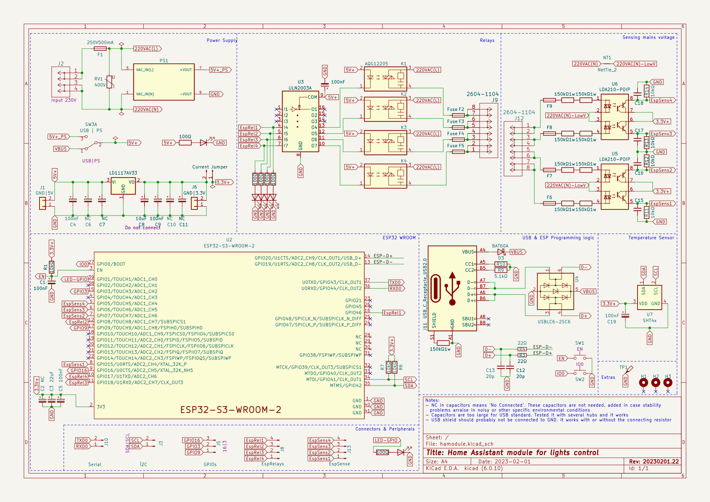

 # Home automation lights controller - ESPHome & Home Assistant compatible

 This circuit controls home lights following these rules:
 1. Safe: Safety is first and is not traded in any decision
 1. Fail safe: If this device fails, the ligts are still controllable using the mechanical switches
 1. Follows standard instalation: This device does not require you to wire your house for it
 1. It can be installed centrally

 Following those rules and using as a reference a multi-switch light controlled with a mechanical latching relay, this is the wiring idea:


A normal circuit sends all push buttons to the latching relay, which controlls the lights.
This circuit (ESPHome) is a side-car to the latching relay acting as an standard push button, but also sensing the output of the latching relay to detect if the lights are on or off.

This device is extensible:
- Expose I2C pins, to connect any I2C sensor
- 3.3V jumper: Allows to disconnect the internal ESP32, and replace it by any other microcontroller
- Relays pins: Relays can be controlled with an external microcontroller or device directly 
- Current sensing pins: Current sensing information is exposed through those pins. This can be used to connect any external microcontroller or any other device
- Output pins for 3.3 and 5V
- ESPHome compatible - It's very easy to integrate to Home Assistant

This device has several security measurements:
- Input fast-blown fuse
- Input MOV
- Slow fuses in every relay output
- Slow fuses in every mains detection input
- 4kv insulated PS for low voltage
- Comformal coating with 90kV/mm2 insulation
- High precision temperature sensor

# How does it work?
Section under development.
## Mains sensing
Section under development. In here there will be a detailed description on how Mains is sensed.
Few teaser pictures:


## Relays
Section under development. In here there will be a detailed description on why SSR with snubber relay was selected


# Version 22
[Detailed information](PCB/schematics-v22-pcbway/)

Since Version 17: 
* Cut-out ESP32 Antena area
* Move silkscreen for readability




# Simulate mains sensing cirquit

You can simulate the circuit online at [lushprojects](http://lushprojects.com/circuitjs/circuitjs.html?ctz=CQAgjCAMB0l3BWEBmGZkDYAcmte2AJwYYgDskISClCApgLRhgBQAbiA8Stp91pUoQaIAEyookmAhYB3EABYsIAYuVgFCqCwAma8JvBhRYyMpM66AMwCGAVwA2AF137RZE8xOizYkJdtHFz0mUh9lJQMtC2t7Z1dQ0wjzDz8AuJd5SPcTSNxtLOV8rlJ8yDlOMDDfRNQtcvkvJPAMSnCCytLIaNEtOu0AJz5SVUjVSlR4coAPFAojJAVIMiMI0xAHAHsbHRYlldFe5v721nlD6KWxI-7yjgRRFJMH819BRQnoZCkoaBksuDHHzNcpDJZtVIvMSpWhTCrIYG9CaImEsADGHzavnB0JMglgUwUhGJJNJZNIaG6ogwYA8WDAWAUyAQWEIvzgZxQKNygJyHRx7Sh7XKAGcWljzEdhZJbA4RXQWGDAQjaI8ue8wFM4BUBakcSqOkLIWqDeVNpIMPUPsT1ey4GR6aIkG1JMgWObaSBLZIljbnQS4IQyBgEBgneA-J63ebxF6rb62f6pkGQ2GkN4xN83UA) 

```
$ 1 0.000005 30.13683688681966 70 5 50 5e-11
v -96 368 -96 80 0 1 50 230 0 0 0.5
w 48 80 48 144 0
d 48 144 112 208 2 default
d 48 272 112 208 2 default
d -16 208 48 144 2 default
d -16 208 48 272 2 default
w 48 272 48 368 0
w 48 368 -96 368 0
w -16 208 -16 304 0
w 112 208 160 208 0
w -16 304 224 304 0
r -96 80 48 80 0 300000
x 370 115 407 118 4 20 load
407 224 208 304 208 1
w 224 240 224 304 0
v 528 272 528 208 0 0 40 3.3 0 0 0.5
w 400 208 320 208 0
r 400 272 528 272 0 50000
w 320 240 320 272 0
c 400 208 400 272 0 0.0000049999999999999996 0.11666774048911469 0.001
w 320 272 400 272 0
w 400 208 528 208 0
s 160 208 224 208 0 0 false
r 400 320 528 320 0 1000000
w 400 272 400 320 0
w 528 272 528 320 0
o 0 64 0 4099 320 0.00078125 0 2 0 3
o 17 64 0 4099 5 0.00009765625 1 2 17 3
o 23 64 0 4099 5 0.00009765625 2 2 23 3
```

## How to order from JLCPCB:


# Older versions: 21
* Using the new ESP32-S3
* Replace CP2102 by ESP integrated USB support
* Replace USB protection diodes with an IC


# Older versions: 20
[Detailed information](PCB/schematics-v20-pcbway/)

Since Version 17: 
* Mains sensing is inverted, to make better use of rectifier capacitors and have constant reading
* Removed low-v fuse. Having only one fuse is enough since PS has overcurrent protection and >4kV insulation
* Moved screwes. Now it has one extra holding point
* Expose GPIO12 and GPIO33, for better board extenisbility 
* Moved to SSR with integrated snubber instead of mechanical relays. The kickback of the inductive load (latching relays) was creating spikes and restarting the ESP32 
* Adding SMD caps to the 3.3v and 5V lines in case they are needed in noisy conditions
* Separate GND for relays and ULN from the digital signal plane, to reduce noise 


# Older versions: Version 19
[Detailed information](PCB/schematics-v19-jlcpcb/)

Since Version 17: 
* Adding fuses to every relay output. This is to protect in case two relays are closed at the same time, and one of them is accidentally wired to N. Current could flow from one to the other
* Moving SHT40 and extending the footprint, to make it easier to solder
* Moving LD11. Now it'seasier to fit in the case
* Tested with both optocouplers: LDA210 and ILD755-D


# Older versions: Version 17
[Detailed information](PCB/schematics-v17-safety-jlcpcb/)

Since Version 13 there were many changes: 
* Changed optocoupler for another one with less current requirements.
* Change resistors to 150k x 2
* Adding fuses to every sensing channel, and remove fuse in N
* Adding a separate fuse for 5V and 3.3V track
* Littlefuse have a holder, instead of solder directly to PCB
* Adding ESP32 onboard module
* Adding Temperature sensor, to detect if the board gets too hot
* Adding USB-C powered by CP2102N UART chip
* Remove capacitors from 5v->3.3 converter, to avoid inrush current at the USB
* Adding external pull-up resistors for ESP32, some pins do not have internal pull-ups
* Adding mains nets with creepage and clearance  
* Replacing mains connectors by Wago with levers. They are super reliable and easy to use!
* Replace analog temperature sensor by SHT40 using I2C protocol.
* Also adding I2C terminal, so we can plug any I2C sensor


The enclosure compared with a DIN relay. Size is perfect :)


# Older version: Version 16
Size comparison between V16 and V13:


# Older versions: Version 13

This version was minimized by:
* Using SPST-NO 3A smaller relays
* Using SMD 3W 29k resistors instead of THT
* Removed external buttons connector
* Removed external leds connector
* Using SMD ULN2003A instead of THT
* HCPL3700 THT capacitors replaced by Tantalum SMD

Security additions:
* Added fuse at the neutral return from the sensors (F2)
* Resistors are before HCPL3700, to make them work with less than 4V to N, instead of 110V to N

Stability:
* Added filter capacitor to ULN2003A
* Added filter capacitors to LD1117AV33

Others:
* Added led indicator when powered-on


# Older versions: Version 9

Device schematics (under development) 


# Older versions: Versions 1
I have no clue what I was thinking when I did this. I guess I put it here to show how much I had to learn :) 


