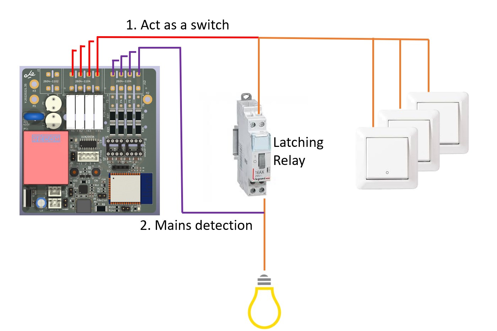

 # Home automation led controller custom module

 This circuit controll home lights following these rules:
 1. Safe: Safety is not trade in any decision.
 1. Fail safe: If this device fails, the ligts are still controllable using the mechanical switches.
 1. Follows standard instalation: This device does not require you to wire your house for it.
 1. It can be installed centrally

 Following those rules and using as a reference a multi-switch light controlled with a mechanical latching relay, this is the wiring idea:

A normal circuit sends all push buttons to the latching relay, which controlls the lights.
This circuit (ESPHome) is a side-car to the latching relay acting as an standard push button, but also sensing the output of the latching relay to detect if the lights are on or off.

# Version 17
[Detailed information](PCB/schematics-v17-safety-jlcpcb/)

Since Version 2 there were many changes: 
* Changed optocoupler for another one with less current requirements.
* Change resistors to 150k x 2
* Adding fuses to every sensing channel, and remove fuse in N
* Adding a separate fuse for 5V and 3.3V track
* Littlefuse have a holder, instead of solder directly to PCB
* Adding ESP32 onboard module
* Adding Temperature sensor, to detect if the board gets too hot
* Adding USB-C powered by CP2102N UART chip
* Remove capacitors from 5v->3.3 converter, to avoid inrush current at the USB
* Adding external pull-up resistors for ESP32, some pins do not have internal pull-ups
* Adding mains nets with creepage and clearance  

# Version 2

This version was minimized by:
* Using SPST-NO 3A smaller relays
* Using SMD 3W 29k resistors instead of THT
* Removed external buttons connector
* Removed external leds connector
* Using SMD ULN2003A instead of THT
* HCPL3700 THT capacitors replaced by Tantalum SMD

Security additions:
* Added fuse at the neutral return from the sensors (F2)
* Resistors are before HCPL3700, to make them work with less than 4V to N, instead of 110V to N

Stability:
* Added filter capacitor to ULN2003A
* Added filter capacitors to LD1117AV33

Others:
* Added led indicator when powered-on

# Version 1

Device schematics (under development) 

