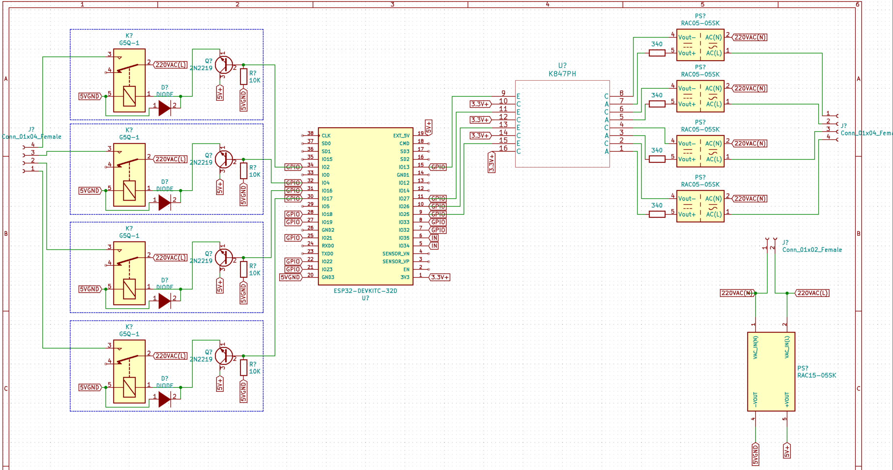
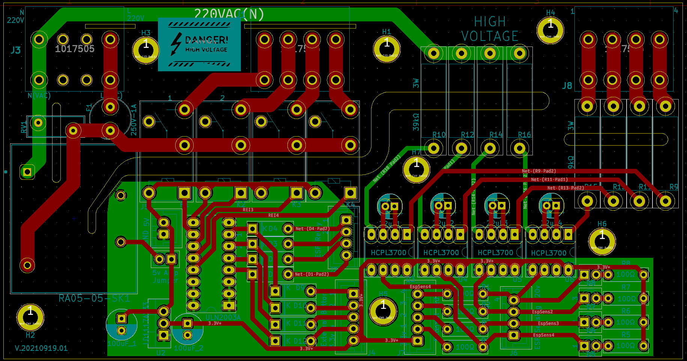

 # Home automation led controller custom module

 This circuit controll home lights following these rules:
 1. Safe: Safety is not trade in any decision.
 1. Fail safe: If this device fails, the ligts are still controllable using the mechanical switches.
 1. Follows standard instalation: This device does not require you to wire your house for it.
 1. It can be installed centrally

 Following those rules and using as a reference a multi-switch light controlled with a mechanical latching relay, this is the wiring idea:

A normal circuit sends all push buttons to the latching relay, which controlls the lights.
This circuit (ESPHome) is a side-car to the latching relay acting as an standard push button, but also sensing the output of the latching relay to detect if the lights are on or off.

Device schematics (under development) 

