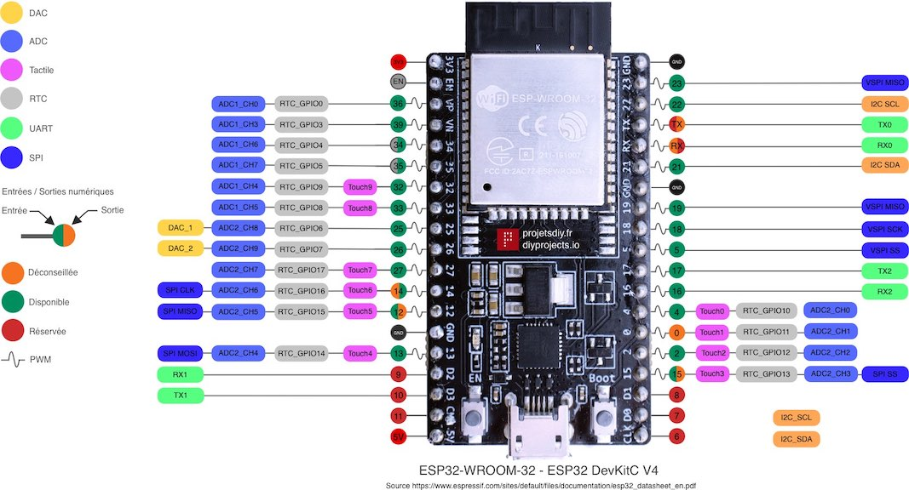

If you want to use the Arduino IDE from Windows:

Check the usb-serial CHIP. It is usually CP2102.  
Install the CP22102 driver: https://www.silabs.com/developers/usb-to-uart-bridge-vcp-drivers

From arduino, the GPIO pin Nr is the green nr in this schematic:

[source](https://diyprojects.io/esp32-gpio-pins-and-associated-functions-i-o-pwm-rtc-i2c-spi-adc-dac/#.YQghro4zZm8)